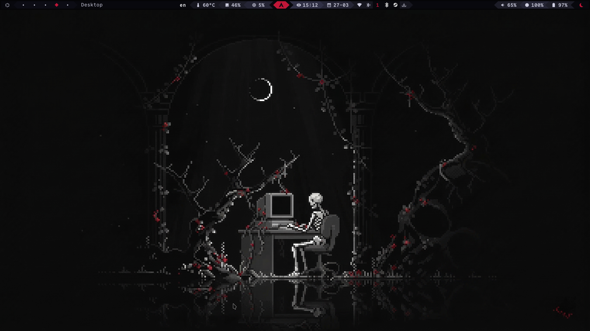
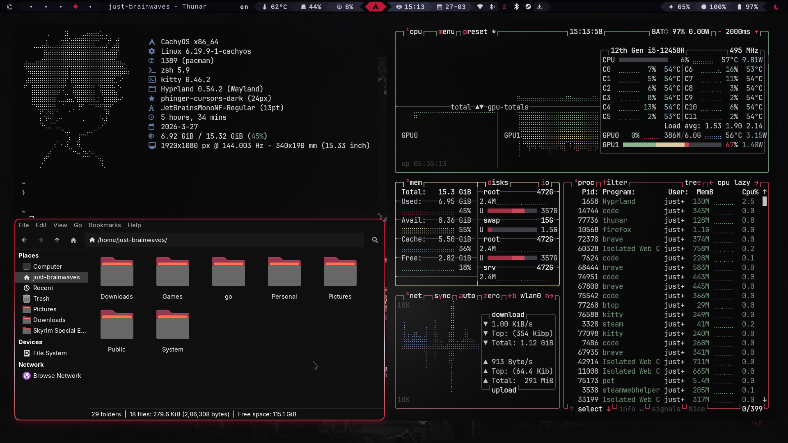
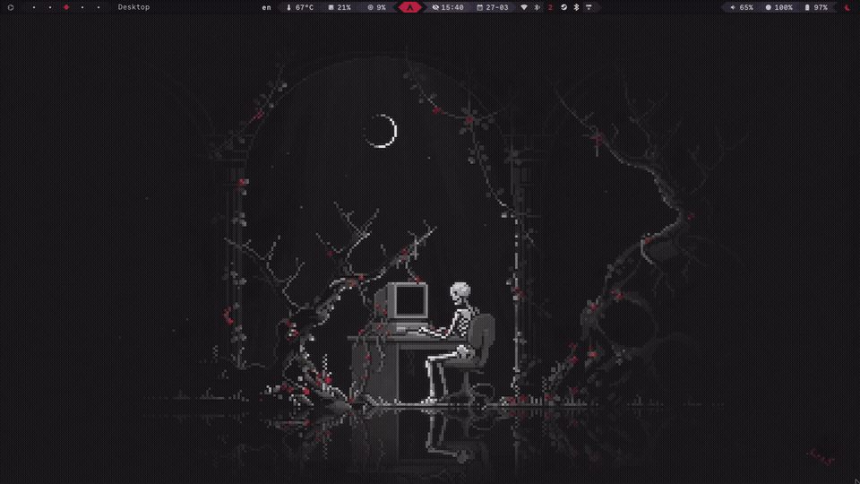
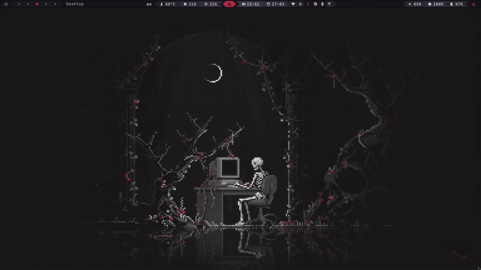

<div align="center">

        
        ███╗   ███╗ ██████╗  ██████╗ ███╗   ██╗███████╗██╗  ██╗██████╗ ██╗███╗   ██╗███████╗
        ████╗ ████║██╔═══██╗██╔═══██╗████╗  ██║██╔════╝██║  ██║██╔══██╗██║████╗  ██║██╔════╝
        ██╔████╔██║██║   ██║██║   ██║██╔██╗ ██║███████╗███████║██████╔╝██║██╔██╗ ██║█████╗  
        ██║╚██╔╝██║██║   ██║██║   ██║██║╚██╗██║╚════██║██╔══██║██╔══██╗██║██║╚██╗██║██╔══╝  
        ██║ ╚═╝ ██║╚██████╔╝╚██████╔╝██║ ╚████║███████║██║  ██║██║  ██║██║██║ ╚████║███████╗
        ╚═╝     ╚═╝ ╚═════╝  ╚═════╝ ╚═╝  ╚═══╝╚══════╝╚═╝  ╚═╝╚═╝  ╚═╝╚═╝╚═╝  ╚═══╝╚══════╝
        

*void black · crimson berries · moonlight white*


</div>

---

<div align="center">

> *A dark pixel art rice built around a single wallpaper — the white deer standing alone in a void shrine.*
> *Every color, every border, every animation pulled directly from the scene.*

</div>

---

## 📸 Showcase

<div align="center">

| Desktop | Apps |
|---|---|
|  |  |

</div>

### Beautiful Wallpaper Transitions


### Application Launcher & Workspaces


### Tiling Apps


### Scratchpad


<!-- Drop new screenshots/gifs here as you add them -->

---

## 🌑 Palette

| Name | Hex | Usage |
|---|---|---|
| Void | `#08080d` | Bar background, editor bg |
| Abyss | `#0c0c14` | Module backgrounds |
| Iron | `#252535` | Borders, separators |
| Steel | `#303045` | Clock module, active elements |
| Moonlight | `#cecee0` | Primary text |
| Bone | `#eaeaf4` | Active/focused text |
| Deer White | `#f6f6fa` | Brightest text, prompt |
| Crimson | `#9e0e2e` | Secondary accent |
| **Scarlet** | **`#c01638`** | **Primary accent — active workspace, cursor, borders** |
| Roseblood | `#de2448` | Warnings, git conflicts |
| Blush | `#f04068` | Critical states |
| Sage | `#408055` | Charging, git add, hints |
| Lichen | `#5a9e6e` | Secondary green, bluetooth |

---

## 🛠 Stack

| Component | Software |
|---|---|
| OS | CachyOS (Arch-based) |
| Compositor | Hyprland |
| Bar | Waybar |
| Terminal | Kitty |
| Shell | Zsh + Starship |
| Launcher | Rofi-wayland |
| Notifications | Swaync |
| Lock Screen | Hyprlock |
| Idle Daemon | Hypridle |
| Login Manager | SDDM + sddm-astronaut-theme |
| File Manager | — |
| Editor | Neovim (LazyVim) + VS Code |
| System Monitor | btop |
| Visualizer | Kwybars |
| Wallpaper | swww |
| GTK Theme | Graphite-Dark (black rimless) |
| Icon Theme | Papirus-Dark |
| Cursor | phinger-cursors-dark |
| Fonts | JetBrainsMono Nerd Font · SF Pro Display |
| Clipboard | cliphist |
| Screenshot | grim + slurp + swappy |
| Color Picker | hyprpicker |
| Window Switcher | hyprswitch |

---

## 📁 File Structure

```
~/.config/
├── hypr/
│   ├── hyprland.conf        # main config
│   ├── theme.conf           # Moonshrine borders + blur
│   ├── animations.conf      # spring/glide bezier curves
│   ├── keybindings.conf     # all keybinds
│   ├── windowrules.conf     # per-app rules
│   ├── hypridle.conf        # idle timeouts
│   └── hyprlock.conf        # lock screen
├── waybar/
│   ├── config.jsonc         # modules
│   ├── style.css            # GTK-safe styles
│   └── theme.css            # Moonshrine color variables
├── rofi/
│   ├── config.rasi          # rofi configuration
│   └── theme.rasi           # Moonshrine theme
├── swaync/
│   ├── config.json          # notification config
│   └── style.css            # Moonshrine notifications
├── kitty/
│   └── kitty.conf           # terminal + Moonshrine colors
├── starship/
│   └── starship.toml        # prompt — crimson ❯
├── fastfetch/
│   ├── config.jsonc         # system info
│   └── ascii.txt            # custom ascii art
├── kwybars/
│   ├── config.toml          # audio visualizer
│   └── themes/
│       └── moonshrine.toml  # custom color theme
└── nvim/
    └── lua/plugins/
        └── colorscheme.lua  # kanagawa-dragon + overrides
```

---

## ⚡ Installation

> **Warning** — This will overwrite existing configs. Back up first.

### 1. Clone the repo

```bash
git clone https://github.com/yourusername/moonshrine-dots
cd moonshrine-dots
```

### 2. Install dependencies

```bash
paru -S hyprland waybar rofi-wayland kitty zsh starship \
        swww hyprlock hypridle hyprswitch hyprpicker \
        swaync sddm sddm-astronaut-theme kwybars-bin \
        zsh-autosuggestions zsh-syntax-highlighting \
        grim slurp swappy cliphist wl-copy \
        papirus-icon-theme phinger-cursors graphite-gtk-theme-black-rimless-normal-git \
        otf-commit-mono-nerd ttf-jetbrains-mono-nerd fastfetch
```

### 3. Copy configs

```bash
cp -r config/* ~/.config/
```

### 4. Set Zsh as default shell

```bash
chsh -s $(which zsh)
```

### 5. Cache zoxide

```bash
zoxide init zsh > ~/.zoxide-init.zsh
```

### 6. Enable SDDM

```bash
sudo systemctl enable sddm
```

### 7. Reload Hyprland

```bash
hyprctl reload
```

---

## ⌨️ Keybinds

| Keybind | Action |
|---|---|
| `Super + Return` | Open terminal (Kitty) |
| `Super + Space` | App launcher (Rofi) |
| `Super + Q` | Close window |
| `Super + F` | Fullscreen |
| `Super + V` | Float toggle |
| `Super + 1-9` | Switch workspace |
| `Super + Shift + 1-9` | Move window to workspace |
| `Alt + Tab` | Window switcher (hyprswitch) |
| `Print` | Screenshot (full) |
| `Shift + Print` | Screenshot (region) |
| `Alt + Print` | Screenshot → edit (swappy) |
| `Ctrl + Print` | Screenshot → clipboard |
| `Super + Shift + W` | Cycle wallpaper |

---

## 🎨 Credits

- Waybar - https://github.com/sejjy/mechabar - Themed By ME
- FastCat ascii — [m3tozz/FastCat](https://github.com/m3tozz/FastCat)
- Neovim theme — [kanagawa.nvim](https://github.com/rebelot/kanagawa.nvim)
- Wallpapers Are All AI Generated Except For The Deer Moon Wallpaper.


---

<div align="center">

*made with obsession on Arch With CachyOS*

**[r/unixporn](https://reddit.com/r/unixporn)** · **[hyprland](https://hyprland.org)**

</div>